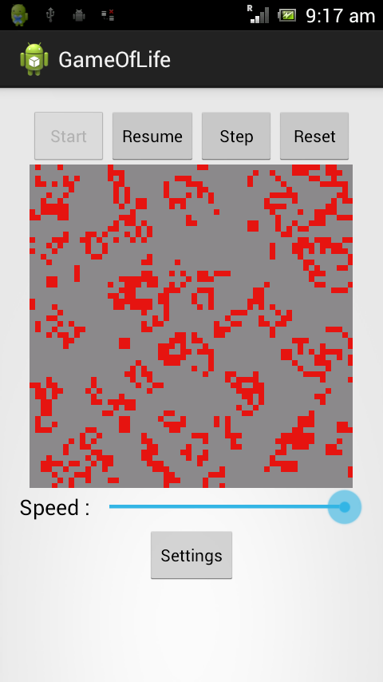
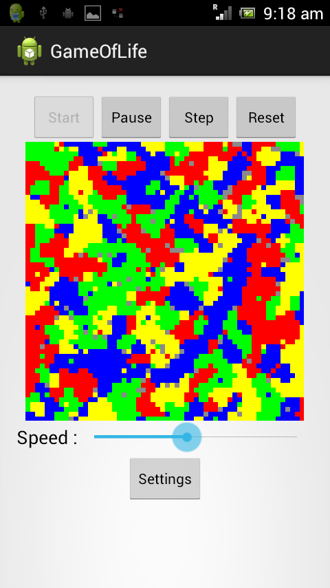
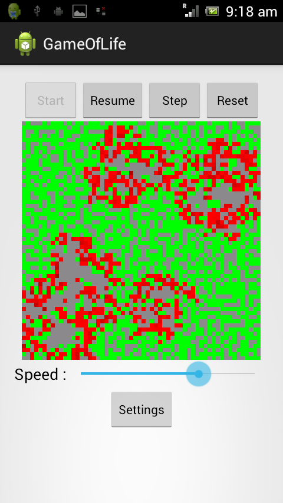
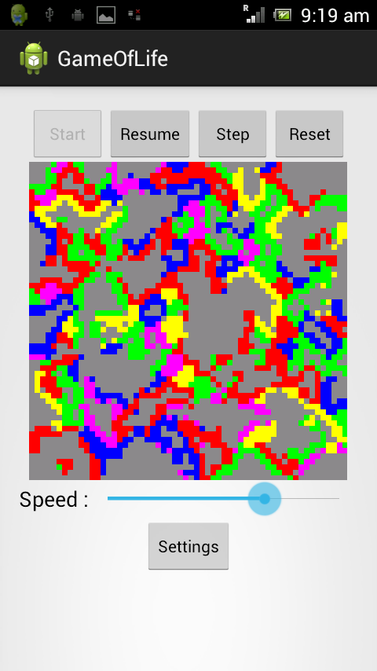
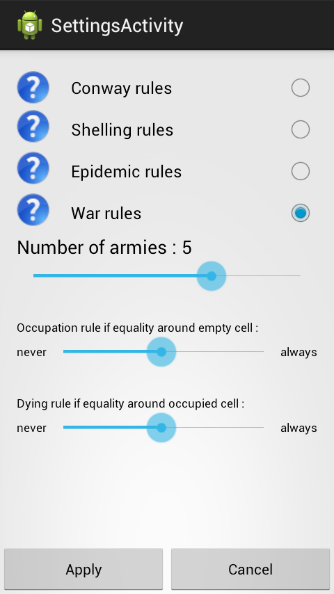

GameOfLife
==========

<h2>Android Application<h2>
<h3>Show some Game of Life like algorithms</h3>
Some algorithms have been included, some well known, others from my own :

<ul>
<li>Conway rules : the standard Game Of Life</li>
</ul>

<ul>
<li>Shelling rules : the Shelling implementation showing automatic segregational behaviour of populations</li>
</ul>

<ul>
<li>Epidemic rules : one of my own to play with some deathly desease extending over the world !</li>
</ul>

<ul>
<li>War rules : also one of my own to reproduce some fighting behavior throught simple rules. Some settings are available to change rules.</li>
</ul>

&nbsp;

All these are still work in progress : I am currently adding some settings to each of these rules.

Enjoy and let me know some about it :-)
